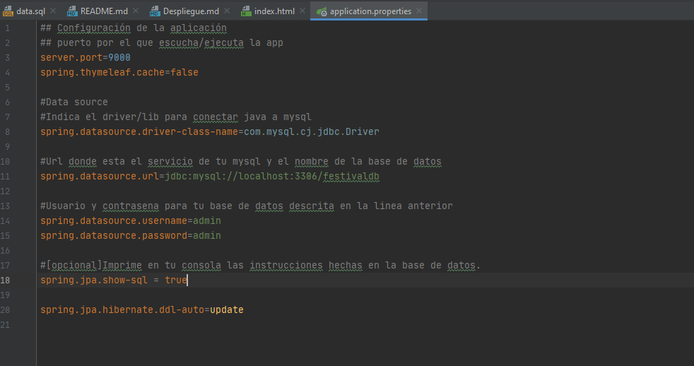

# PROYECTO FINAL JPA/HIBERNATE
## PROCESO DE DESPLIEGUE DE LA APLICACIÓN

En el despliegue de nuestro servicio web o aplicación intervienen varios componentes o elementos:  
Por un lado, el servidor de aplicaciones que usamos. Por el otro, la base de datos MySQL que se encuentra en una máquina o servicio docker.

### SERVIDOR DE APLICACIONES

Para esta parte del proyecto hemos decidido usar Tomcat. Esto se debe a que ya viene integrado con Hibernate y Spring, por lo que su 
configuración es menos delicada que la de WildFly (la otra opción que teníamos para arrancar nuestro **QuevedoFest**).
En este caso, lo único que debemos de hacer es seleccionar el tipo de despliegue **Jar** a la hora de crear nuestro proyecto, 
configurar el fichero **/src/main/java/resources/application.properties** y ejecutar el arranque de la aplicación.  
En este fichero se indican algunas cosas como el puerto de ejecución del programa, el driver, url y nombre de la base de datos, su usuario y contraseña,
y algunas opciones como la actualización de tablas y datos cada vez que arrancamos la aplicación.  

Si quisieramos desplegar nuestro servicio web con WildFLy, habría que seleccionar el empaquetamiento de tipo **War** en la creación del proyecto 
y configurar el servicio del WildFly en docker mediante un fichero ".yml". Con alguna instrucción en el docker-compose.yml que hiciese
compartir una ruta entre el servicio y nuestro host, compartiriamos el fichero war con el servidor.
Además, habría que configurar de forma previa un datasource mediante la consola de administrador de Wildfly (puerto 9990) o mediante su fichero de configuración **standalone.xml**

### BASE DE DATOS

Como ya se ha nombrado anteriormente en algún que otro punto, utilizamos MySQL como motor de base de datos. Dicho servicio se encuentra 
en un Docker que ejecutamos/levantamos con el fichero **docker-compose.yml** de la raíz.

### DESPLIEGUE DE LA APLICACIÓN

Para desplegar el proyecto hemos de seguir una serie de pasos:

1. Situarnos en la raíz del proyecto y ejecutar en un cmd/PowerShell "docker-compose up -d". Con esto levantaremos la base de datos definida en el fichero .yml.
2. Abrir el proyecto con IntelliJ o Eclipse.
3. Revisar el fichero "/src/main/resources/application.properties" para comprobar que el acceso a la base de datos está bien configurado y conocer el puerto por el que se ejecuta la aplicación.
4. Conectar IntelliJ con la base de datos (herramienta Database a la derecha de la interfaz). 
5. Usuario: admin, Password: admin, Nombre bbdd: festivaldb.
6. A través de DBeaver o alguna herramienta parecida, insertar los datos de data.sql en la base de datos. Copiar y pegar todo el documento.
7. Una vez haya conexión entre nuestro IDE y nuestra bbdd, ejecutar la aplicación y reproducirla por el **puerto 9000** en el navegador: localhost:9000/.  
